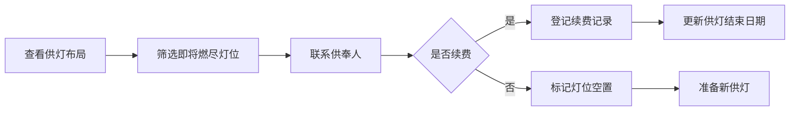

## 1. 产品概述

寺院供灯管理面板是一款面向寺院管理人员的供灯全生命周期管理工具，涵盖供灯布局展示、供奉人信息管理、酥油作坊生产记录、供灯消耗统计等核心功能。

- **目标用户**：寺院香灯师、库房管理人员、住持等
- **核心价值**：数字化管理供灯状态，提升寺院管理效率，确保供灯秩序井然

## 2. 核心功能

### 2.1 用户角色

| 角色 | 登录方式 | 核心权限 |
|------|----------|----------|
| 香灯师 | 账号密码登录 | 查看供灯布局、管理供奉人信息、登记供灯续费 |
| 库房管理员 | 账号密码登录 | 管理作坊灯油领用、制作数量登记、查看消耗统计 |
| 住持 | 账号密码登录 | 全部权限，查看全局统计报表 |

### 2.2 功能模块

1. **供灯布局图**：殿堂平面布局展示，灯位状态实时显示，灯型与供奉人标注
2. **灯位详情**：供奉人信息展示、供奉日期、续费历史记录
3. **作坊管理**：灯油领用登记、酥油灯制作数量记录
4. **消耗统计**：每日各殿堂供灯消耗折线图、生产与消耗对比

### 2.3 页面详情

| 页面名称 | 模块名称 | 功能描述 |
|----------|----------|----------|
| 供灯总览 | 殿堂选择器 | 切换不同殿堂查看供灯布局 |
| 供灯总览 | 灯架布局图 | 网格状展示所有灯位，颜色区分状态，标注灯型与供奉人 |
| 供灯总览 | 灯位详情弹窗 | 显示供奉人姓名、灯型、起止日期、续费记录 |
| 作坊管理 | 灯油领用记录 | 登记灯油领用日期、数量、领用人 |
| 作坊管理 | 制作数量记录 | 登记每日酥油灯制作数量、规格 |
| 消耗统计 | 折线图表 | 展示近30天各殿堂供灯消耗趋势 |
| 消耗统计 | 生产消耗对比 | 对比制作数量与消耗数量的差值 |

## 3. 核心流程

### 3.1 供灯管理流程

香灯师每日巡查各殿堂，通过管理面板查看供灯状态。对即将燃尽的灯联系供奉人确认是否续费，已熄灭的灯位登记并准备新供灯。

### 3.2 作坊生产流程

库房管理员每日登记灯油领用情况和酥油灯制作数量，系统自动统计消耗与生产的对比数据。

## 4. 用户界面设计

### 4.1 设计风格

- **主色调**：暖金色 (#D4A853)、深棕色 (#5C4033)、米白背景 (#F9F5EC)
- **辅助色**：常亮绿 (#4CAF50)、预警黄 (#FFC107)、熄灭红 (#F44336)
- **整体风格**：禅意古朴、宁静雅致，融入传统寺院元素
- **按钮风格**：圆角矩形，微阴影，hover有轻微浮起效果
- **字体**：标题使用楷体/宋体类衬线字体，正文使用清晰易读的无衬线字体
- **图标**：线性图标，配合灯笼、莲花等佛教元素
- **布局**：卡片式布局，顶部导航 + 侧边菜单 + 主内容区

### 4.2 页面设计概览

| 页面名称 | 模块名称 | UI 元素 |
|----------|----------|---------|
| 供灯总览 | 殿堂选择器 | 标签页切换，暖金色选中态 |
| 供灯总览 | 灯架布局图 | 网格布局，灯位卡片带状态颜色，悬停放大效果 |
| 供灯总览 | 状态图例 | 色块 + 文字说明，位于布局图下方 |
| 灯位详情 | 弹窗 | 半透明遮罩，卡片式弹窗，顶部关闭按钮 |
| 作坊管理 | 数据表格 | 斑马纹表格，操作按钮列 |
| 消耗统计 | 折线图 | 多色折线，坐标轴清晰，hover显示数据点 |

### 4.3 响应式

- 桌面端优先设计，最低适配 1280px 宽度
- 平板端侧边栏收起为图标模式
- 灯架布局图支持鼠标滚轮缩放和拖拽平移

### 4.4 微动效

- 灯位卡片悬停：轻微放大 + 阴影加深
- 弹窗出现：淡入 + 轻微缩放
- 状态切换：颜色渐变过渡
- 页面切换：淡入淡出过渡
- 数字变化：滚动数字动画
