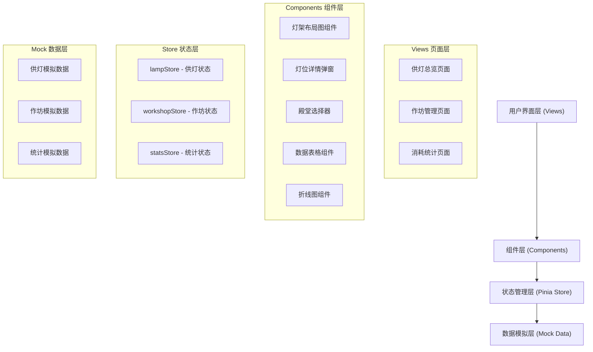
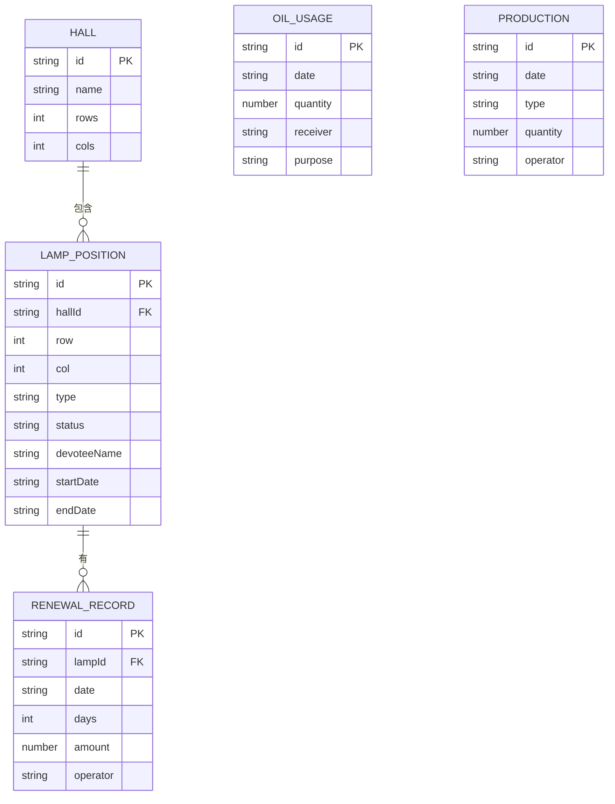

## 1. 架构设计



## 2. 技术描述

- **前端框架**：Vue 3.3 + TypeScript 5.0
- **构建工具**：Vite 5.0
- **状态管理**：Pinia 2.x
- **路由管理**：Vue Router 4.x
- **UI 组件库**：Element Plus（按需引入，用于表格、弹窗、表单等）
- **图表库**：ECharts 5.x（用于消耗统计折线图）
- **样式方案**：SCSS + CSS Variables
- **数据方案**：前端 Mock 数据，无后端依赖

## 3. 路由定义

| 路由路径 | 页面名称 | 说明 |
|----------|----------|------|
| / | 供灯总览 | 默认页面，展示殿堂灯架布局图 |
| /workshop | 作坊管理 | 灯油领用记录与制作数量登记 |
| /statistics | 消耗统计 | 各殿堂供灯消耗趋势折线图 |

## 4. 数据模型

### 4.1 核心数据类型

```typescript
// 灯型枚举
enum LampType {
  GHEE = 'ghee',       // 酥油灯
  LOTUS = 'lotus',     // 莲花灯
  ELECTRONIC = 'electronic', // 电子灯
  ETERNAL = 'eternal'  // 长明灯
}

// 灯状态枚举
enum LampStatus {
  ON = 'on',           // 常亮
  WARNING = 'warning', // 即将燃尽
  OFF = 'off'          // 已灭
}

// 灯位信息
interface LampPosition {
  id: string
  hallId: string       // 所属殿堂ID
  row: number          // 行号
  col: number          // 列号
  type: LampType       // 灯型
  status: LampStatus   // 状态
  devoteeName: string  // 供奉人姓名
  startDate: string    // 供奉开始日期
  endDate: string      // 供奉结束日期
  renewalRecords: RenewalRecord[] // 续费记录
}

// 续费记录
interface RenewalRecord {
  id: string
  date: string         // 续费日期
  days: number         // 续供天数
  amount: number       // 金额
  operator: string     // 操作人
}

// 殿堂信息
interface Hall {
  id: string
  name: string         // 殿堂名称
  rows: number         // 灯架行数
  cols: number         // 灯架列数
}

// 灯油领用记录
interface OilUsageRecord {
  id: string
  date: string         // 领用日期
  quantity: number     // 领用数量（升）
  receiver: string     // 领用人
  purpose: string      // 用途
}

// 制作记录
interface ProductionRecord {
  id: string
  date: string         // 制作日期
  type: LampType       // 灯型
  quantity: number     // 制作数量（盏）
  operator: string     // 制作人
}

// 每日消耗统计
interface DailyConsumption {
  date: string
  hallId: string
  hallName: string
  consumption: number  // 消耗数量
}
```

### 4.2 数据结构关系



## 5. 目录结构

```
src/
├── assets/              # 静态资源
│   └── styles/          # 全局样式
│       └── variables.scss
├── components/          # 公共组件
│   ├── LampGrid/        # 灯架布局图组件
│   │   ├── LampGrid.vue
│   │   └── LampCell.vue
│   ├── LampDetail/      # 灯位详情弹窗
│   │   └── LampDetailModal.vue
│   ├── HallSelector/    # 殿堂选择器
│   │   └── HallSelector.vue
│   └── LineChart/       # 折线图组件
│       └── LineChart.vue
├── views/               # 页面组件
│   ├── LampOverview.vue
│   ├── WorkshopManage.vue
│   └── StatisticsView.vue
├── stores/              # Pinia 状态管理
│   ├── lamp.ts
│   ├── workshop.ts
│   └── statistics.ts
├── mock/                # Mock 数据
│   ├── lampData.ts
│   ├── workshopData.ts
│   └── statsData.ts
├── types/               # TypeScript 类型定义
│   └── index.ts
├── router/              # 路由配置
│   └── index.ts
├── App.vue
└── main.ts
```

## 6. 状态管理设计

### 6.1 lampStore

- **state**: hallList, currentHallId, lampList, selectedLampId
- **getters**: currentHallLamps, lampStatusCount, warningLamps
- **actions**: selectHall, selectLamp, renewLamp, updateLampStatus

### 6.2 workshopStore

- **state**: oilUsageList, productionList
- **getters**: monthlyOilUsage, monthlyProduction
- **actions**: addOilUsage, addProduction, deleteRecord

### 6.3 statisticsStore

- **state**: dailyConsumptionList, dateRange
- **getters**: consumptionByHall, totalConsumption, productionVsConsumption
- **actions**: setDateRange, fetchConsumptionData
